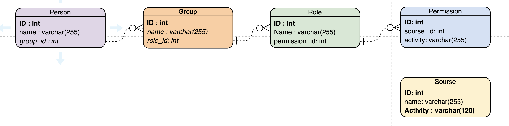

=== Данные. Объекты и Артибуты.

Далее описание основных объектов системы. Отнощения сущьностей влияют на архитектуру БД.
В ТЗ это будет описано в стиле "Необходимо реализовать ..."

==== Принятые допущения в ходе решения задания
Пользователя рассматриваем как участника какой-то группы.
Только группа имеет права, пользователь сам не является владельцем прав на изменения какого-либо объекта.

Если какому-то пользователю необходимо создать эксклюзивное право, то для него нужно создать группу (группу для одного участника)
и после добавить право в эту группу.

==== ER диаграмма

==== Описание объектов

|===
|*Объект*       |*Атрибуты*     | *Тип*         | *Связи и описание*

.3+|*Person* - Пользователь, которому выдаются права на изменение ресурсов
                |id             | int           | Идентификатор пользователя
                |name           | varchar(255)  | Имя, не используется для связей
                |group_id       | int           | Идентификатор группы, один пользователь может состоять в 0 - множестве групп

.3+| *Group* - Группа, объект объединяющий пользователей со схожими потребностями (должностными инструкциями и тд.)
                |id              | int          | Идентификатор группы
                |name            | varchar(255) | Имя, не используется для связей
                |role_id         | int          | Идентификатор роли, группа пользователей может иметь несколько ролей

.3+| *Role* - Роль, объект группировки прав
                |id              | int          | Идентификатор роли
                |name            | varchar(255) | Имя, не используется для связей
                |permission_id   | int          | Идентификатор права, используется для добавления прав группе. Роль может иметь 0 - множество прав.

.3+|*Permission* - Право, возможность выполнения действия над ресурсом, предоставляется ролям
                |id             | int           | ИД права
                |sourse_id      | int           | ИД ресурса
                |activity       | varchar(255)  | наименование активности (create, delete, edit..)

.3+|*Sourse* - Ресурс, объект, подвергающийся изменениям.
                |id             | int           | ИД ресурса
                |name           | varchar(255)  | Имя ресурса
                |activity       | varchar(255)  | Активность, используется для сохранения всех доступных действий над ресурсом
|===

Некоторые огооврки:

- тип данных параметров id не обязательно должен быть int, может быть и строкой. Лично я лучше одношусь к идентификаторам строковым,
так как втречала неудачные округление 'id = 001'  до 'id = 1'. Впрочем и строковые идентификаторы имеют минус, как пример  "   MyLogin" и "MyLogin" (trim).

- от объекта Sourse можно отказаться, однако вопросы контроля навещивания несуществующих функций придется все равно отслеживать каким-то частям системы, будут это контракты взаимодействий или валидаторы,...
Как минимум я это вижу как защиту от дурака, при попытке навесить пермишен с действием  'eedit', а не 'edit'.