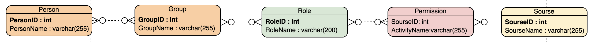
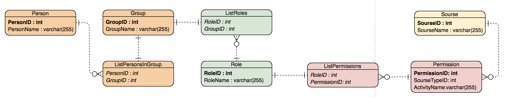

:sectnums:
:sectnumlevels: 6
:toc: left
:toclevels: 4
:toc-title: Оглавление

=== Данные. Объекты и артибуты.

Раздел содержит описание основных объектов системы.

==== Принятые допущения в ходе решения задания
Пользователя рассматриваем как участника какой-то группы.
Только группа имеет права, пользователь сам не является владельцем прав на изменения какого-либо объекта.

Если какому-то пользователю необходимо создать эксклюзивное право, то для него нужно создать группу (группу для одного участника)
и после добавить право в эту группу.

==== ER диаграмма

==== Описание объектов

|===
|*Объект*       |*Атрибуты*     | *Тип*         | *Списание*

.2+|*Person* - Пользователь, которому выдаются права на изменение ресурсов
                |PersonID       | int           | Идентификатор пользователя
                |name           | varchar(255)  | Имя, не используется для связей

.2+| *Group* - Группа, объект объединяющий пользователей со схожими потребностями (должностными инструкциями и тд.)
                |GroupID         | int          | Идентификатор группы
                |GroupName       | varchar(255) | Имя, не используется для связей

.2+| *Role* - Роль, объект группировки прав
                |RoleID          | int          | Идентификатор роли
                |RoleName        | varchar(255) | Имя, не используется для связей

.2+|*Permission* - Право, возможность выполнения действия над ресурсом, предоставляется ролям
                |SourseID        | int           | ИД ресурса
                |ActiviyuName    | varchar(255)  | Название активности

.2+|*Sourse* - Ресурс, объект, подвергающийся изменениям.
                |SourseTypeID    | int           | ИД типа ресурса
                |SourseName      | varchar(255)  | Имя ресурса
|===

==== Описание отношений

Имеются следующие связи между объектами:

. Каждый объект Person находится в нескольких объектах Group
. Каждый объект Group может иметь несколько объектнов Person
. Каждый объект Group может иметь несколько обхектов Role
. Каждый объект Role может быть у нескольких объектов Group
. Каждый объект Role может иметь несколько объектов Permission
. Каждый объект Permission может быть у нескольких объектов Role
. Каждый объект Permission обязана иметь ровно одну связь с объектом Sourse (TODO: не нашла способа рисовать на схеме сплошные стрелки, нужно найти)
. Каждый объект Sourse может иметь связь с несолькими объектами Permission

==== Нормализованная ER диаграмма

Нормализованная схема выглядит следующим образом.

Появились новые сущности:

* ListPersonsInGroup - связка Person и Group, сохраняет список участников группы
* ListRoles - связка Group и Role, сохраняет список ролей у группы
* ListPermissions - связка Role и Permission, сохраняет список прав у роли

