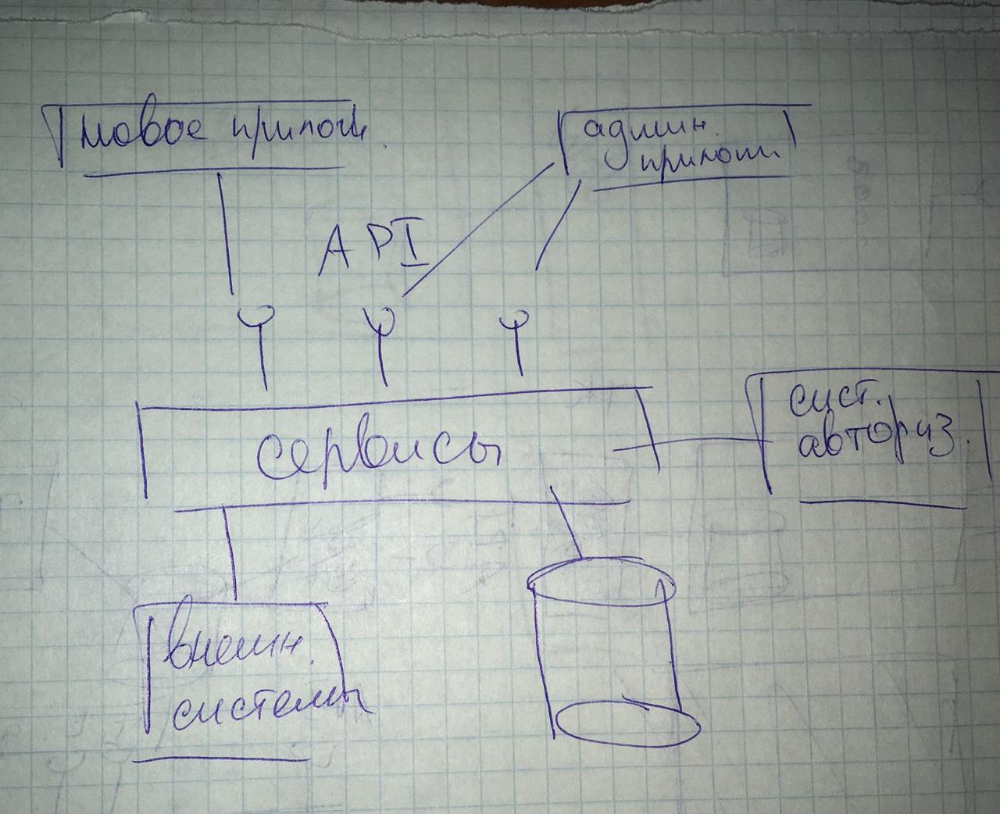

:sectnums:
:sectnumlevels: 6
:toc: left
:toclevels: 2
:toc-title: Оглавление

== Задание

include::../tasks/task1.adoc[]

== Открытые вопросы

Вопросы, возникшие в результате выполнения тестового задания помечены `TODO` в тексте.
Вопрос относятся к постановке задачи, уточнению требований и бизнес-процесоов, а также необходимость консультации с разработчиками.

Примечания, встречающиеся в тексте, означают мою позицию относительно выбора того или иного решения, или ссылка на опыт или его отсутвие по какому-либо вопросу.

Признаюсь, есть места которые не доделаны, я знаю что это пробелы в документации подлежащие исправлениям, поэтому такие места тоже отмечены `TODO`.

TODO: Не ясна желаемая архитектура будущего решения.
Их задания понятно, что будет новое приложение, для которого надо REST API (узнать действия досупные пользователю).
А вот с выставлением другого функционала есть вопросы и варианты:

. систему сделать _монолитом_, выставить API на все сервисы, новое приложение и администрирующее приложение - тонкие клиенты
. систему сделать _систему + БД_, выставить API на все сервисы, новое приложение и администрирующее приложение - тонкие клиенты
. систему сделать _систему + БД_, выставить API для нового приложения, администраторское приложение сделать толстым клиентом.
. сделать сервисы только для нового приложения, вставить API, остальной фунцкионал реализовать путем написания скриптов запускаемся на клиенте к БД
. сделать монолит или систему + БД, сервисы выставить на шину, для новогоприложения сделать шлюз
. что нибудь еще

Мне более всего нравится вариант 2,

TODO: перерисовать в visio

== Решение

include::data_level.adoc[]

include::logic_level.adoc[]

include::customer_level.adoc[]
